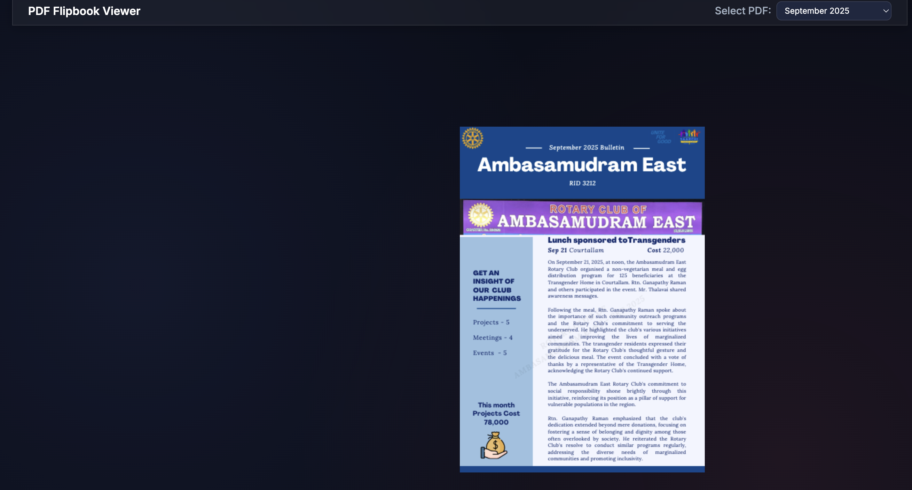
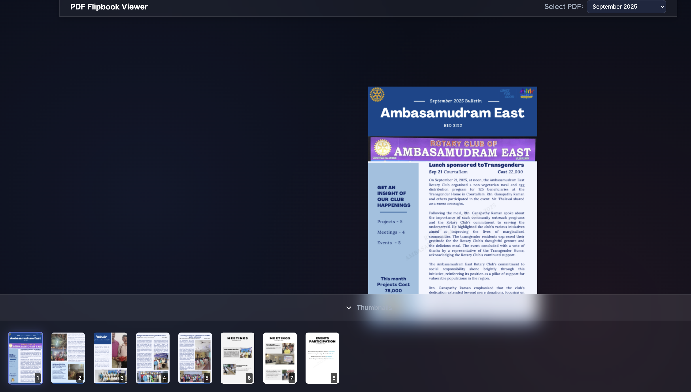

# PDF Flipbook Viewer

An interactive PDF viewer with realistic page-turning effects, built with PDF.js and Turn.js. Features a modern dark theme, thumbnail navigation, zoom controls, and responsive design.

## Features

- 📖 **Interactive Page Turning** - Realistic flipbook animation with Turn.js
- 🎨 **Modern Dark Theme** - Beautiful glassmorphism design with gradient effects
- 🔍 **Zoom Controls** - Zoom in/out with keyboard shortcuts (Ctrl/Cmd + Plus/Minus)
- 🖼️ **Thumbnail Navigation** - Collapsible bottom drawer with page thumbnails
- 📱 **Responsive Design** - Works seamlessly on desktop and mobile devices
- ⌨️ **Keyboard Shortcuts** - Navigate and zoom using keyboard controls
- 🎯 **Click Navigation** - Click left/right sides of pages to navigate
- 🔧 **Minimal UI** - Compact 45px header maximizes viewing space

## Screenshots

### Main Interface

### Thumbnail Navigation

## Usage

1. Open `index.html` in your web browser
2. Select a PDF from the dropdown menu
3. Use mouse clicks, thumbnails, or keyboard shortcuts to navigate

## Technologies Used

- **PDF.js** - PDF rendering and processing
- **Turn.js** - Page turning animations
- **jQuery** - DOM manipulation and event handling
- **CSS3** - Modern styling with glassmorphism effects
- **HTML5 Canvas** - High-quality page rendering

## Browser Compatibility

- Chrome/Chromium (recommended)
- Firefox
- Safari
- Edge

## License

MIT License - feel free to use and modify as needed.
